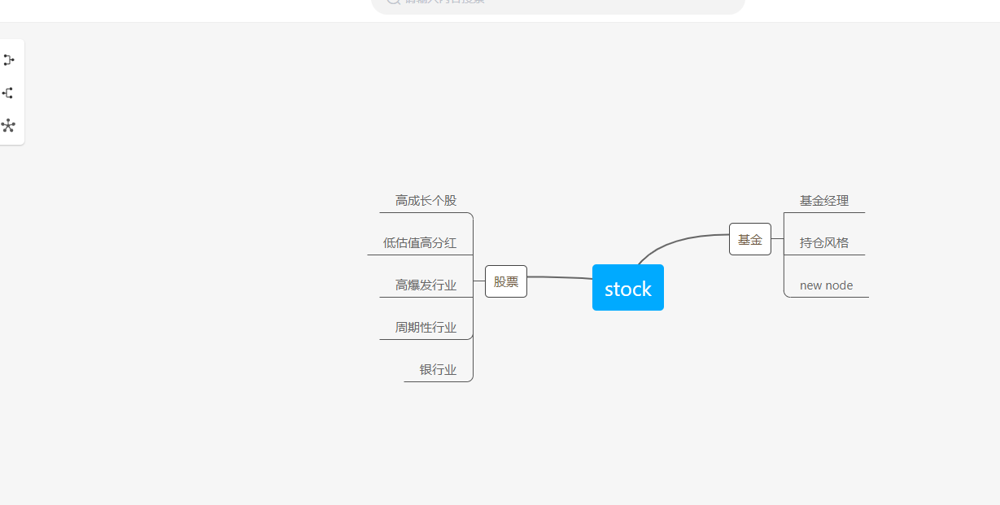
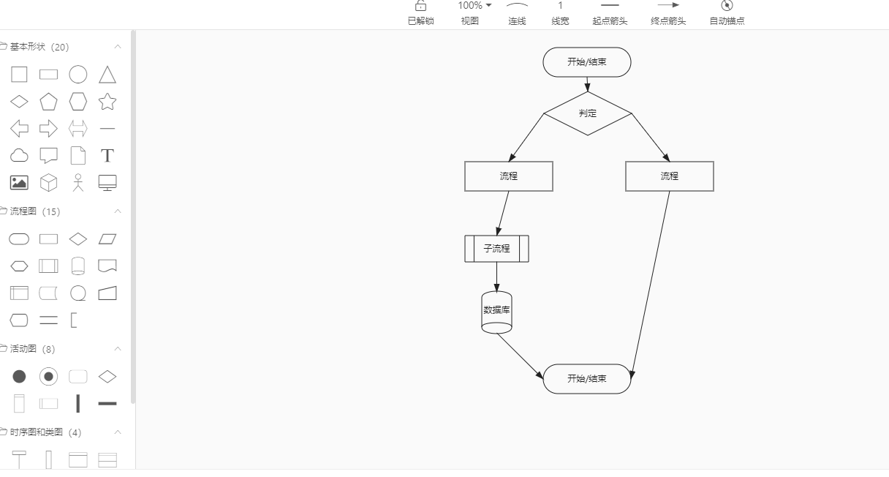

# jvs框架快速部署


## 部署介绍：


JVS是面向软件开发团队可以快速实现应用的基础开发框架，采用微服务分布式框架，提供丰富的基础功能，集成众多业务引擎，它灵活性强，界面化配置对开发者友好，底层容器化构建，集合持续化构建。

JVS是“软开企服”推出的面向软件开发团队可以快速实现应用的基础开发框架


建议内存大小16G+

`安装过程中如出现其它任何问题可联系技术支持群`


## 安装docker、docker-compose（安装中需要有一定的运维基础，如果遇到问题请联系客服微信描述问题提交工单。我们会安排人员为您解决。）

#### 安装docker 和docker-compose （如已经安装 可以跳过）

```bash
curl -C- -O --retry 3 https://iptables.cn/file/docker/jvs-docker && chmod a+x jvs-docker && ./jvs-docker -I
```

## 下载项目

1、直接下载方式  https://gitee.com/software-minister/jvs-docker-compose

2、git下载方式：`git clone https://gitee.com/software-minister/jvs-docker-compose.git`

## 部署项目


#### 替换主机ip地址
请将${ip}修改为本地IP 

sed -i -e 's/jvs-minio/${ip}/g'  ./mysql/nacos.sql


- 部署数据库
```bash
docker-compose -f docker-compose-db.yml  up -d
```
- 查看nacos是否启动
```bash
# 程序依赖nacos 请保证能正常访问nacos后 再执行应用部署
curl -X GET   'http://127.0.0.1:8848/nacos/v1/cs/configs?dataId=jvs-gateway&group=jvs&tenant=jvs'
```
- 部署应用
```bash
# 应用启动 根据硬件情况而定 请等待几分钟
docker-compose up -d 
```

帐号：`admin`
密码:   `123456`

### 访问后台`http://localhost`
### 访问知识库 `http://localhost:8080`
### nacos `http://localhost:8848/nacos`


## 常见故障处理  [点我查看](http://knowledge.bctools.cn/#/detail?knowledgeId=d728e1ed49b66706fd4f9f7a64349841&type=document_html&id=1d51f6ddd145aa319394bd597a027f1d&security=false&key=83f6cf7bc4184691e8f53e0153936824)


####知识库大概页面
#### 思维导图

### 流程图

#### 表单


### 技术支撑群

.png)

